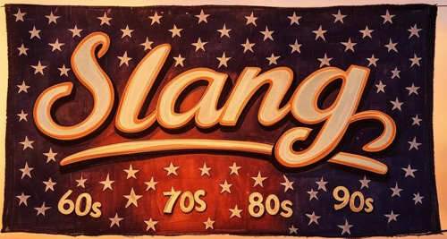

# American-Slang AI Dataset (1960s-1990s)

Welcome to **American-Slang Dataset**—a crowd-sourced time capsule of American slang from the 60s to the 90s, built to train  AI to 'talk' real. This ain’t about the over-scraped 2000s (the internet’s got “yeet” on lock)—we’re digging into the pre-digital gold: “dig it” from the hippie haze, “far out” from disco nights, “tubular” from the 80s, and “phat” from the 90s. If you lived it, we want your lingo!

## Why We’re Doing This

We're trying to capture the vernacular of pre-Internet American culture from in 60s–90s. Most modern AI datasets are flooded with post-2000s chatter—Reddit scraps, X posts, all that jazz. But the raw, unfiltered slang from the 60s to 90s? That’s harder to snag. It’s in your memories, not some web crawl. This repo’s here to collect that dope, decade-by-decade, straight from the source—Boomers, Gen X, Millennials, anyone who’s got the lines. AI training undoubtably already has a bunch of of knowledge of certain phrases, but we're trying to get some real-world experience into the data outside of what might already be out there. AIs need some more tasky slang to chew on, and where better to get it from than from those who lived the periods.

The goal? A dataset to train AI to groove like it’s 1969 one minute, then kick it 90s-style the next. Think of it as a linguistic jukebox for an AI that’s all about retro realness.

## Intended Purpose

This stash of slang—think thousands of lines like “That’s outta sight!” or “Word up, homie!”—is raw training data. It's intende to be fed into tokenizers and transformers teaching AI how to talk. The output? An AI that can riff in 60s hippie-speak, 70s funk, 80s neon slang, or 90s grunge vibes—depending on the mood. It’s not just data; it’s a vibe we’re building together.

## How It Works

- **Decades**: We’re zeroing in on 60s, 70s, 80s, and 90s—pre-2000s magic.
- **Your Part**: Drop your era’s slang in `/data/[decade]/raw_lines.txt` (see [CONTRIBUTING.md](./CONTRIBUTING.md)).

- **My Part**: I’ll curate it (via `/curated_lines.txt`) and tokenize it for training.
- **The Dream**: A dataset big enough (10k–20k lines) to make AI sound righteous :)

## Folder Vibes

- `/data/`: Where the slang lives—raw and curated files per decade.
- `/scripts/`: Python tools to clean and tokenize the goods.
- `/docs/`: Guides like this one.

## Get In On It

Got some 60s–90s lingo to share? Add it to the repo or hit up Issues with your lines. Check [CONTRIBUTING.md](./docs/CONTRIBUTING.md) for the how-to. Let’s make this a community jam—your words, my AI, one far-out collab.

Questions? Ping me here or on X/Reddit (I’ll drop my handle when we launch). Stay copacetic, and let’s build something tubular!

---

## Word'em up yo!
